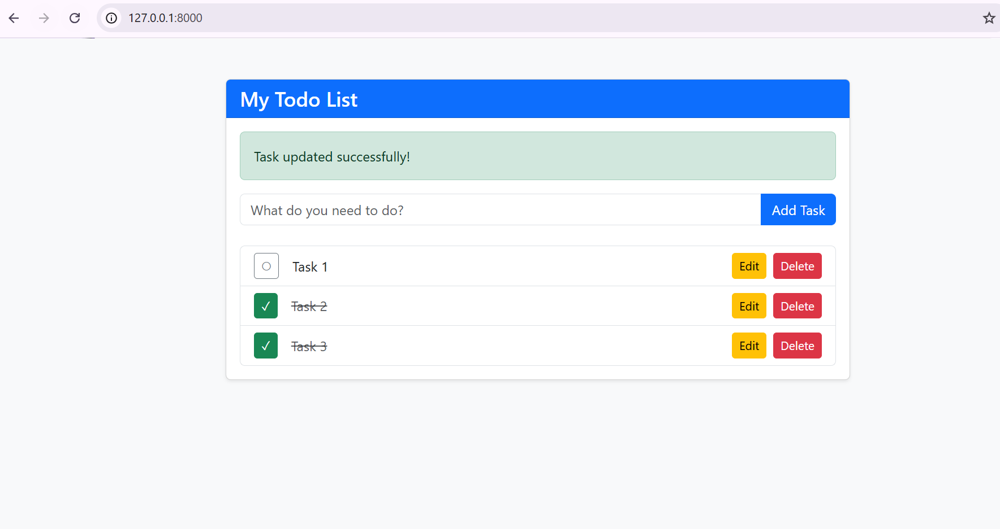

# Laravel Todo App ✅

A simple, responsive Task Management application built to demonstrate fundamental full-stack web development skills using the Laravel framework. 

## 📸 Screenshots

### Dashboard


## Features
* **Create** new tasks with form validation to prevent empty submissions.
* **Read** and display a list of tasks, sorted by the newest first.
* **Update** existing task titles.
* **Toggle** tasks as completed or pending.
* **Delete** tasks with a JavaScript confirmation safeguard.

## Tech Stack
* **Backend:** Laravel (PHP)
* **Frontend:** Blade Templating Engine, HTML5, CSS3
* **Styling:** Bootstrap 5 (via CDN)
* **Database:** MySQL
* **Interactivity:** Vanilla JavaScript

## 💻 Prerequisites
To run this project locally, you will need:
* PHP (v8.1 or higher)
* Composer
* MySQL Server (e.g., XAMPP, Laragon)

## ⚙️ Local Setup & Installation
Follow these steps to get a local copy up and running.

**1. Clone the repository:**
```bash
git clone [https://github.com/johnstep2k19-code/laravel-todo-app.git](https://github.com/johnstep2k19-code/laravel-todo-app.git)
cd laravel-todo-app
2. Install PHP dependencies:

Bash
composer install
3. Set up your Environment variables:
Duplicate the .env.example file and rename it to .env.

Bash
cp .env.example .env
4. Generate an application key:

Bash
php artisan key:generate
5. Configure your Database:
Open the .env file and update your database credentials. (Note: Update the DB_PORT if your MySQL runs on a custom port like 3307).

Code snippet
DB_CONNECTION=mysql
DB_HOST=127.0.0.1
DB_PORT=3306 
DB_DATABASE=todo_app
DB_USERNAME=root
DB_PASSWORD=
6. Run Database Migrations:
Create the todo_app database in your MySQL client, then run:

Bash
php artisan migrate
7. Start the local development server:

Bash
php artisan serve
Your application will now be running at http://localhost:8000